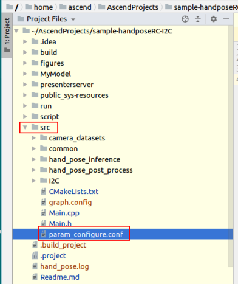
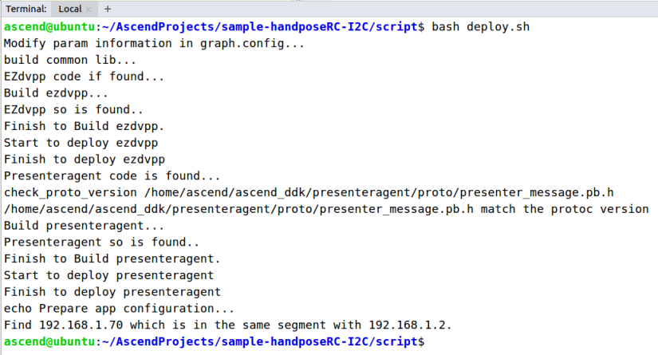
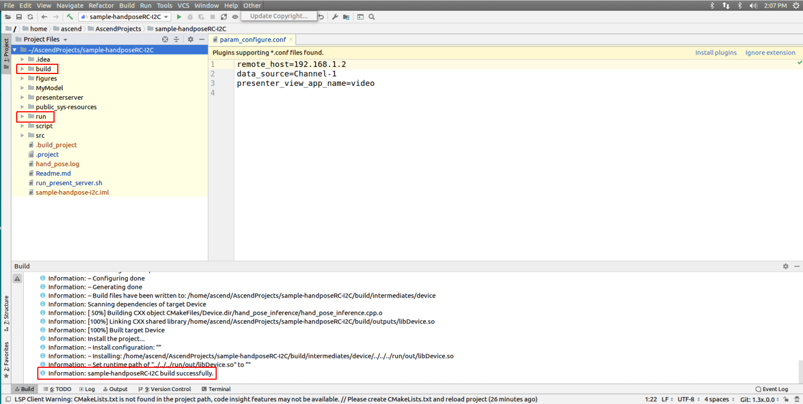
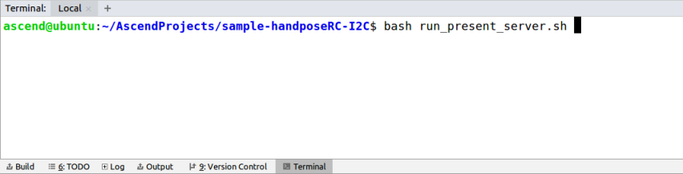
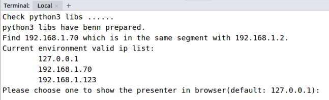
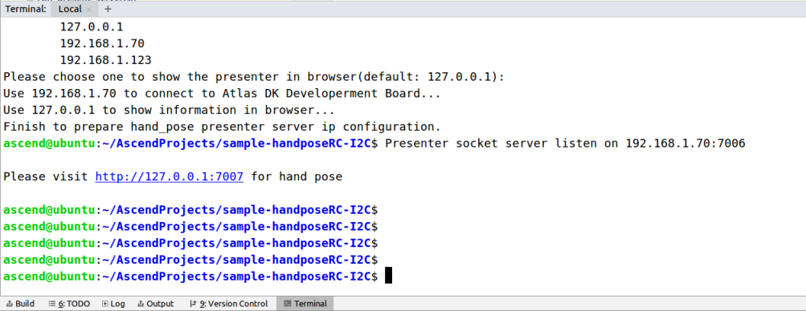
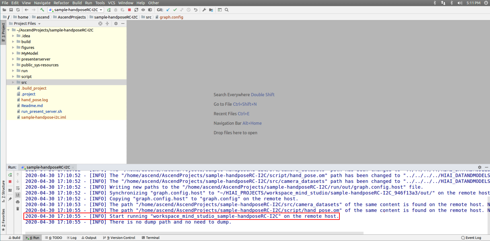
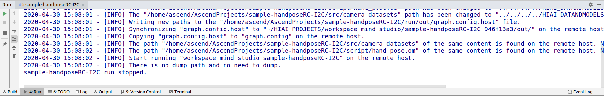

# Atlas200DK application for hand gesture<a name="EN-US_TOPIC_0232642690"></a>

You can deploy this application on the Atlas 200 DK to collect camera data in real time and display hand keypoints.

The applications in the current version branch adapt to  [DDK&RunTime](https://ascend.huawei.com/resources) **1.32.0.0 and later**.


## Atlas200DK application overview (C++)<a name="en-us_topic_0228461904_section7994174585917"></a>

### Setup
-  Setup MindStudio and development environment [using ADKInstaller](https://www.huaweicloud.com/intl/en-us/ascend/doc/Atlas200DK/1.32.0.0(beta)/en/en-us_topic_0238626392.html)
-  Setup SD card [using ADKInstaller](https://www.huaweicloud.com/intl/en-us/ascend/doc/Atlas200DK/1.32.0.0(beta)/en/en-us_topic_0238626392.html) 
-  [Connect Raspberry Pi camera to board](https://www.huaweicloud.com/intl/en-us/ascend/doc/Atlas200DK/1.32.0.0(beta)/en/en-us_topic_0204328003.html)


### Code layout
The Handpose application can be deployed on the Atlas200DK with or without the RC car. 
The program consists of 3 engines. In the **src** directory, each engine has a folder with a **.cpp** and **.h** file.
The engines are connected in the **graph.config** file.

This application contains the following engines:
-  Camera
-  Inference
-  Postprocess

<br />**Camera engine** takes frames from the Raspberry Pi camera and sends them to the inference engine. <br /><br />
**Inference engine** resizes the frames using [DVPP](https://www.huaweicloud.com/intl/en-us/ascend/doc/Atlas200DK/1.32.0.0(beta)/en/en-us_topic_0204324961.html) and then performs inference using the [Offline Model](https://www.huaweicloud.com/intl/en-us/ascend/doc/Atlas200DK/1.32.0.0(beta)/en/en-us_topic_0204328934.html). It then sends the inference results to post process engine.<br /><br />
**Postprocess engine** computes the keypoint coordinates from the inference output. It then computes an RC command (forward, backward, left, right, stop) from the keypoint coordinates. Finally, it sends the results to [presenter server](https://github.com/Atlas200dk/sdk-presenter) and [I2C](https://github.com/Atlas200dk/hardware_expansion/tree/master/sample-i2c)/[UART](https://github.com/Atlas200dk/hardware_expansion/tree/master/sample-uart).


## Deploying the application<a name="en-us_topic_0228461904_section7994174585917"></a>

1.  Open the project.

    Go to the directory that stores the decompressed installation package as the Mind Studio installation user in CLI mode, for example,  **$HOME/MindStudio-ubuntu/bin**. Run the following command to start Mind Studio:

    **./MindStudio.sh**

    Open the  **sample-handposeRC-I2C**  project, as shown in  [Figure 1](#en-us_topic_0228461904_en-us_topic_0203223294_fig05481157171918).

    **Figure  1**  Opening the handpose project<a name="en-us_topic_0228461904_en-us_topic_0203223294_fig05481157171918"></a>  
    

    .

    **Figure  2**  Configuration file<a name="en-us_topic_0228461904_en-us_topic_0203223294_fig0391184062214"></a>  
    

    

    The default configurations of the configuration file are as follows:

    ```
    remote_host=192.168.1.2
    data_source=Channel-1
    presenter_view_app_name=video
    ```

    -   **remote\_host**: IP address of the Atlas 200 DK developer board
    -   _data\_source_: camera channel. The value can be  **Channel-1**  or  **Channel-2**. For details, see "Viewing the Channel to Which a Camera Belongs" in  [Atlas 200 DK User Guide](https://ascend.huawei.com/documentation).
    -   _presenter\_view\_app\_name_: value of  **View Name**  on the  **Presenter Server**  page, which must be unique. The value consists of at least one character and supports only uppercase letters, lowercase letters, digits, and underscores \(\_\).

    > **NOTE:**   
    >-   All the three parameters must be set. Otherwise, the build fails.  
    >-   Do not use double quotation marks \(""\) during parameter settings.  
    >-   Modify the default configurations as required.  

3.  Run the  **deploy.sh**  script to adjust configuration parameters and download and compile the third-party library. Open the  **Terminal**  window of Mind Studio. By default, the home directory of the code is used. Run the  **deploy.sh**  script in the background to deploy the environment, as shown in  [Executing the deploy script](#en-us_topic_0228461904_en-us_topic_0203223294_fig107831626101910).

    **Figure  3**  Running the deploy.sh script<a name="en-us_topic_0228461904_en-us_topic_0203223294_fig107831626101910"></a>  
    

    > **NOTE:**   
    >-   During the first deployment, if no third-party library is used, the system automatically downloads and builds the third-party library, which may take a long time. The third-party library can be directly used for the subsequent build.  
    >-   During deployment, select the IP address of the host that communicates with the developer board. Generally, the IP address is that configured for the virtual NIC. If the IP address is in the same network segment as the IP address of the developer board, it is automatically selected for deployment. If they are not in the same network segment, you need to manually type the IP address of the host that communicates with the developer board to complete the deployment.  

4.  Start building. Open Mind Studio and choose  **Build \> Build \> Build-Configuration**  from the main menu. The  **build**  and  **run**  folders are generated in the directory, as shown in  [Figure 4](#en-us_topic_0228461904_en-us_topic_0203223294_fig1625447397).

    **Figure  4**  Build and files generated<a name="en-us_topic_0228461904_en-us_topic_0203223294_fig1625447397"></a>  
    

    

    > **NOTICE:**   
    >When you build a project for the first time,  **Build \> Build**  is unavailable. You need to choose  **Build \> Edit Build Configuration**  to set parameters before the build.  

5.  Start Presenter Server.

    Open the  **Terminal**  window of Mind Studio. Under the code storage path, run the following command to start the Presenter Server program of the hand pose application on the server, as shown in  [Figure 5](#en-us_topic_0228461904_en-us_topic_0203223294_fig423515251067):

    **bash run\_present\_server.sh**

    **Figure  5**  Starting Presenter Server<a name="en-us_topic_0228461904_en-us_topic_0203223294_fig423515251067"></a>  
    

    

    When the message  **Please choose one to show the presenter in browser\(default: 127.0.0.1\):**  is displayed, type the IP address \(usually IP address for accessing Mind Studio\) used for accessing the Presenter Server service in the browser.

    Select the IP address used by the browser to access the Presenter Server service in  **Current environment valid ip list**, as shown in  [Figure 6](#en-us_topic_0228461904_en-us_topic_0203223294_fig999812514814).

    **Figure  6**  Project deployment<a name="en-us_topic_0228461904_en-us_topic_0203223294_fig999812514814"></a>  
    

    

    [Figure 7](#en-us_topic_0228461904_en-us_topic_0203223294_fig69531305324)  shows that the Presenter Server service has been started successfully.

    **Figure  7**  Starting the Presenter Server process<a name="en-us_topic_0228461904_en-us_topic_0203223294_fig69531305324"></a>  
    

    

    Use the URL shown in the preceding figure to log in to Presenter Server. The IP address is that typed in  [Figure 6](#en-us_topic_0228461904_en-us_topic_0203223294_fig999812514814)  and the default port number is  **7007**. The following figure indicates that Presenter Server has been started successfully.

    **Figure  8**  Home page<a name="en-us_topic_0228461904_en-us_topic_0203223294_fig64391558352"></a>  
    

    The following figure shows the IP address used by Presenter Server and  Mind Studio  to communicate with the Atlas 200 DK.

    **Figure  9**  IP address example<a name="en-us_topic_0228461904_en-us_topic_0203223294_fig1881532172010"></a>  
    

    In the preceding figure:

    -   The IP address of the Atlas 200 DK developer board is  **192.168.1.2**  \(connected in USB mode\).
    -   The IP address used by Presenter Server to communicate with the Atlas 200 DK is in the same network segment as the IP address of the Atlas 200 DK on the UI Host server, for example,  **192.168.1.223**.
    -   The following describes how to access the IP address \(such as  **10.10.0.1**\) of Presenter Server using a browser. Because Presenter Server and  Mind Studio  are deployed on the same server, you can access  Mind Studio  through the browser using the same IP address. 


## Run<a name="en-us_topic_0228461904_section551710297235"></a>

1.  Run the hand pose application.

    On the toolbar of Mind Studio, click  **Run**  and choose  **Run \> Run 'sample-handposeRC-I2C'**. As shown in  [Figure 10](#en-us_topic_0228461904_en-us_topic_0203223294_fig93931954162719), the executable application is running on the developer board.

    **Figure  10**  Application running sample<a name="en-us_topic_0228461904_en-us_topic_0203223294_fig93931954162719"></a>  
    

    

2.  Use the URL displayed upon the start of the Presenter Server service to log in to Presenter Server.

    Wait for Presenter Agent to transmit data to the server. Click  **Refresh**. When there is data, the icon in the  **Status**  column for the corresponding channel changes to green, as shown in the following figure.

    **Figure  11**  Presenter Server page<a name="en-us_topic_0228461904_en-us_topic_0203223294_fig113691556202312"></a>  
    

    > **NOTE:**   
    >-   For the hand pose application, Presenter Server supports a maximum of 10 channels at the same time \(each  _presenter\_view\_app\_name_  parameter corresponds to a channel\).  
    >-   Due to hardware limitations, each channel supports a maximum frame rate of 20 fps. A lower frame rate is automatically used when the network bandwidth is low.  

3.  Run the  **deploy.sh**  script to adjust configuration parameters and download and compile the third-party library. Open the  **Terminal**  tab page of Mind Studio. By default, the home directory of the code is used. Run the  **deploy.sh**  script in the background to deploy the environment, as shown in the figure.

    > **NOTE:**   
    >-   During the first deployment, if no third-party library is used, the system automatically downloads and compiles the third-party library, which may take a long time. The third-party library can be directly used for the subsequent compilation.  
    >-   During deployment, select the IP address of the host that communicates with the developer board. Generally, the IP address is the IP address configured for the virtual NIC. If the IP address is in the same network segment as the IP address of the developer board, it is automatically selected for deployment. If they are not in the same network segment, you need to manually type the IP address of the host that communicates with the Atlas DK to complete the deployment.  

4.  Click the link \(such as  **video**  in the preceding figure\) in the  **View Name**  column to view the result. The confidence of the detected human hand is marked.

## Follow-up Operations<a name="en-us_topic_0228461904_section177619345260"></a>

-   Stopping the hand pose application

    The hand pose application is running continually after being executed. To stop it, perform the following operation:

    Click the stop button shown in  [Figure 12](#en-us_topic_0228461904_en-us_topic_0203223294_fig14326454172518)  to stop the hand pose application.

    **Figure  12**  Stopping hand pose<a name="en-us_topic_0228461904_en-us_topic_0203223294_fig14326454172518"></a>  
    

    

    [Figure 13](#en-us_topic_0228461904_en-us_topic_0203223294_fig2182182518112)  shows that the hand pose application has been stopped.

    **Figure  13**  Hand pose stopped<a name="en-us_topic_0228461904_en-us_topic_0203223294_fig2182182518112"></a>  
    

    

-   Stopping the Presenter Server service

    The Presenter Server service is always in running state after being started. To stop the Presenter Server service of the hand pose application, perform the following operations:

    On the server with  Mind Studio  installed, run the following command as the  Mind Studio  installation user to check the process of the Presenter Server service corresponding to the hand pose application:

    **ps -ef | grep presenter | grep hand\_pose**

    ```
    ascend@ascend-HP-ProDesk-600-G4-PCI-MT:~/sample-handposeRC-I2C$ ps -ef | grep presenter | grep hand_pose
    ascend    7701  1615  0 14:21 pts/8    00:00:00 python3 presenterserver/presenter_server.py --app hand_pose
    ```

    In the preceding information,  _7701_  indicates the process ID of the Presenter Server service for the hand pose application.

    To stop the service, run the following command:

    **kill -9** _7701_


